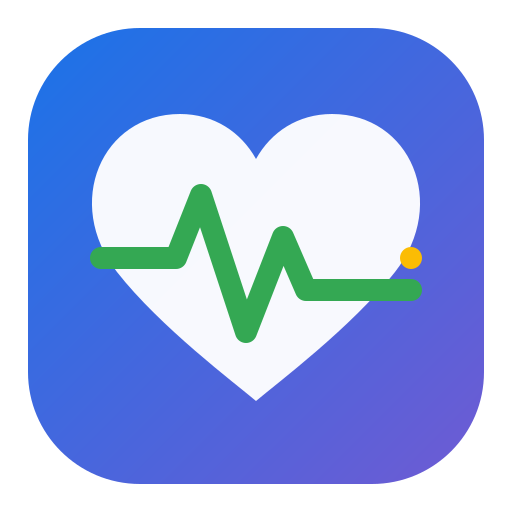
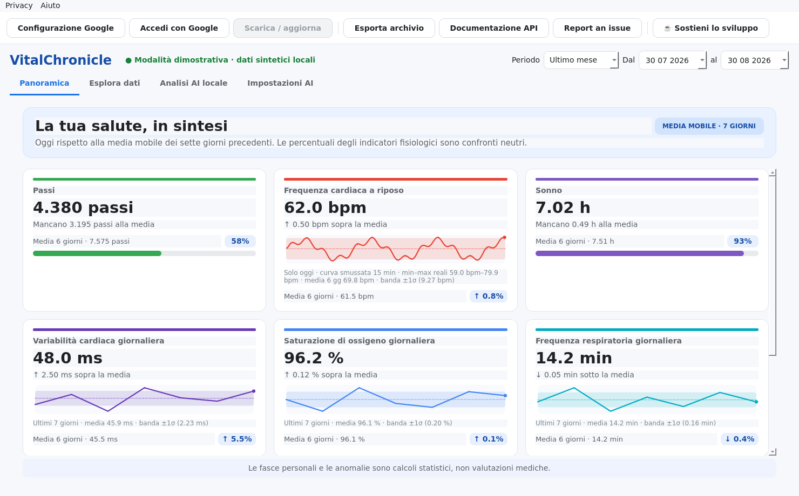
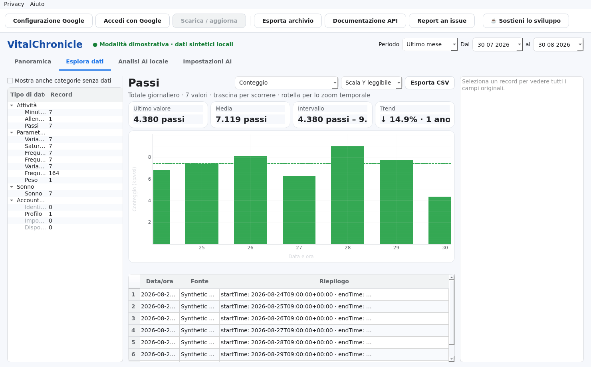
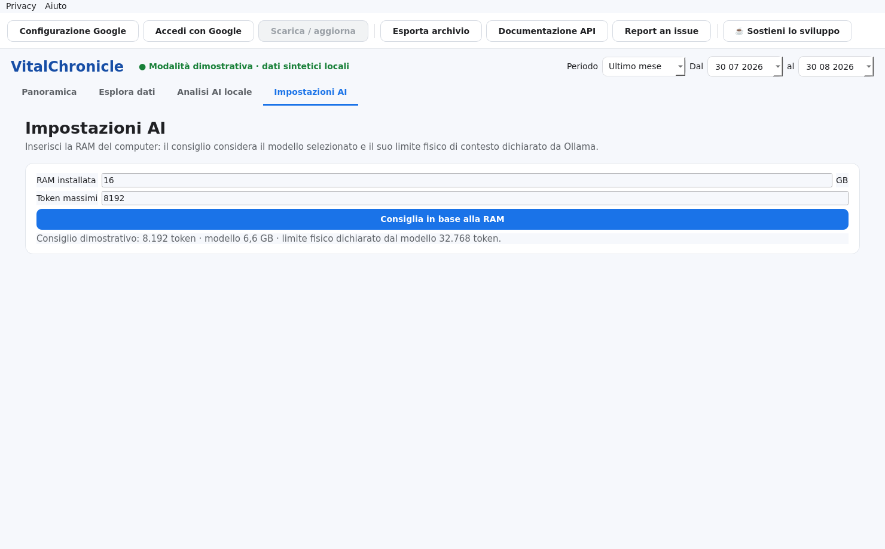

<p align="center">
  
</p>

<h1 align="center">VitalChronicle</h1>

<p align="center"><strong>Your health history, privately understood.</strong></p>

<p align="center">
  <a href="https://github.com/SebRoLENS/google-health-dashboard-ai/releases/latest"></a>
  <a href="https://github.com/SebRoLENS/google-health-dashboard-ai/releases/latest"></a>
  <a href="https://github.com/SebRoLENS/google-health-dashboard-ai/releases/latest"></a>
  <a href="https://github.com/SebRoLENS/google-health-dashboard-ai/releases/latest"></a>
  <a href="https://github.com/SebRoLENS/google-health-dashboard-ai/actions/workflows/ci.yml"></a>
  <a href="LICENSE"></a>
  <a href="https://buymeacoffee.com/sebromi"></a>
</p>

VitalChronicle is a local-first desktop application for downloading, storing,
exploring, and exporting personal data made available through the Google Health API.
It combines adaptive visualisations with optional analysis performed by a local Ollama
model. Health records stay on the computer unless the user explicitly exports them.

> **VitalChronicle is and will remain free and open-source software.** If it is useful
> to you, a voluntary [contribution through Buy Me a Coffee](https://buymeacoffee.com/sebromi)
> helps keep development active and the downloadable packages available.

VitalChronicle is an independent project. It is not affiliated with, endorsed by, or
supported by Google. It is an exploratory wellness-data tool, not a medical device and
not a replacement for professional medical advice.

## Download

**[Download VitalChronicle 1.0.1 for Linux, Windows, or macOS](https://github.com/SebRoLENS/google-health-dashboard-ai/releases/latest)**

| Platform | Release package | Notes |
|---|---|---|
| Linux x86-64 | AppImage + Sigstore bundle | No Python installation required |
| Windows x86-64 | Standalone `.exe` | Unsigned; SmartScreen may warn |
| macOS Apple Silicon | `.dmg` | Ad-hoc signed, not notarised |
| macOS Intel x86-64 | `.dmg` | Ad-hoc signed, not notarised |
| Python 3.10+ | Wheel and source archive | For development or unsupported systems |
| Android | Not included in 1.0.1 | Requires a separate mobile UI and OAuth flow |

Windows and macOS packages are not signed with paid platform certificates. Download
only from the official release page and verify `SHA256SUMS.txt`. The Linux AppImage is
attested through GitHub Actions and includes a detached Sigstore bundle.

## Interface

Screenshots are generated from the real application using synthetic demonstration data.
No personal health record or credential is included in this repository.

### Seven-day overview



The overview distinguishes cumulative metrics from physiological measurements. Steps,
sleep, and active-zone minutes use completion bars against the preceding seven-day
average. Heart rate and other vital measurements use neutral above/below-baseline
comparisons, compact trend plots, and a one-standard-deviation reference band.

### Data explorer



Charts adapt to the selected record: daily bars for steps and energy, point clouds for
dense measurements, stacked bars for sleep stages and heart-rate zones, and readable
vertical ranges for noisy measurements. Panning and zooming operate on time.

### Private local AI


The AI page streams model thinking and then replaces it with the final answer in the
same panel. Automatic analysis uses the complete local history; direct questions use the
explicitly selected period. Incomplete current-day totals are compared with previous
days at the same time of day.

### AI memory and token settings



The user enters installed RAM and receives a model-aware token recommendation. The
value remains editable and is limited only by the physical context reported by Ollama.

## Main capabilities

- guided Google Cloud and OAuth configuration inside the application;
- incremental synchronisation that downloads only missing intervals;
- silent refresh at startup and every ten minutes while the application is open;
- per-category error isolation, warnings, pagination, and resumable local coverage;
- local SQLite archive with CSV, JSON, and complete ZIP export;
- purpose-specific plots for activity, sleep, heart, oxygen, temperature, nutrition,
  workouts, sedentary time, body measurements, and other available categories;
- readable time windows and robust vertical scales for dense measurements;
- seven-day personal baselines and transparent statistical bands;
- local Qwen analysis through Ollama, with NVIDIA 16 GB and CPU-only 32 GB profiles;
- model-update notifications and model-context-aware token recommendations;
- no cloud AI service and no transmission of health data to the developer.

## Quick start

1. Download the package for your operating system from the
   [latest release](https://github.com/SebRoLENS/google-health-dashboard-ai/releases/latest).
2. Start VitalChronicle.
3. Select **Configurazione Google** and follow the wizard.
4. Create a personal Google Cloud project, enable the Google Health API, and add your
   account as a test user if the OAuth project is in Testing mode.
5. Create an OAuth client of type **Web application** with this exact redirect URI:

   ```text
   http://localhost:8765/
   ```

6. Download the OAuth JSON once and import it in the wizard.
7. Sign in through the browser and select **Scarica / aggiorna**.

The complete procedure, screenshots, scope list, and troubleshooting steps are in the
**[detailed user manual](docs/manual.md)**. A versioned PDF manual is attached to every
release.

## Install from source

Python 3.10 or newer is required. On Fedora:

```bash
sudo dnf install python3 python3-pip
git clone https://github.com/SebRoLENS/google-health-dashboard-ai.git
cd google-health-dashboard-ai
python3 -m venv .venv
source .venv/bin/activate
python -m pip install --upgrade pip
python -m pip install -e .
vitalchronicle
```

On Windows activate the environment with `.venv\Scripts\activate`; on macOS and
other Unix-like systems use `source .venv/bin/activate`.

## Google OAuth: Testing or Production?

Testing mode is convenient for personal use and does not require public verification.
Add the intended Google accounts under **Audience → Test users**. For an external OAuth
project in Testing, Google normally issues refresh tokens that expire after seven days,
so VitalChronicle may occasionally ask the user to sign in again.

Production status is not mandatory for personal use. Publishing an app that requests
sensitive or restricted scopes to a wider audience can require Google verification.
Each VitalChronicle user creates and controls their own OAuth client; client secrets and
tokens must never be committed to GitHub or shared with the developer.

## Local AI setup

Install [Ollama](https://ollama.com/), start its service, and pull a compatible model.
For example:

```bash
ollama pull qwen3.5:9b
ollama list
curl -sS http://127.0.0.1:11434/api/version
```

VitalChronicle does not present local-model output as a diagnosis. Wearable data may be
incomplete or inaccurate, correlations do not establish causality, and important health
decisions should be discussed with a qualified professional.

## Documentation

- [Detailed manual](docs/manual.md)
- [Quick start](docs/quick-start.md)
- [Release and maintenance guide](docs/releasing.md)
- [Changelog](CHANGELOG.md)
- [Security policy](SECURITY.md)
- [Contributing guide](CONTRIBUTING.md)

## Privacy and data ownership

Health data are stored in a private local SQLite database. OAuth credentials use the
system keyring when available and otherwise fall back to a user-readable local file with
restricted permissions. Local Ollama analysis is sent only to `127.0.0.1`. The only
remote services contacted are Google for authorised health-data access and the Ollama
registry when checking whether model weights have changed.

The application deliberately retains the historical internal `GoogleHealthViewer` data
directory name so that upgrading from 0.2.12 to VitalChronicle 1.0.1 preserves existing
records, credentials, and settings.

## Support development

VitalChronicle is developed as free, open-source software and will remain so. No feature
is placed behind a donation. If the project saves you time, you can
**[support its continued development on Buy Me a Coffee](https://buymeacoffee.com/sebromi)**.

The same link is available inside the application toolbar and **Aiuto** menu.

## Author and contact

Sebastiano Romi<br>
[sebastiano.romi@gmail.com](mailto:sebastiano.romi@gmail.com)

Bug reports and feature requests belong in the
[GitHub issue tracker](https://github.com/SebRoLENS/google-health-dashboard-ai/issues).

## License

VitalChronicle is released under the [MIT License](LICENSE). The source code is public,
and the software is free to use, study, modify, and redistribute under that license.

If you would like to help the project while keeping it open for everyone,
[Buy Me a Coffee](https://buymeacoffee.com/sebromi).
